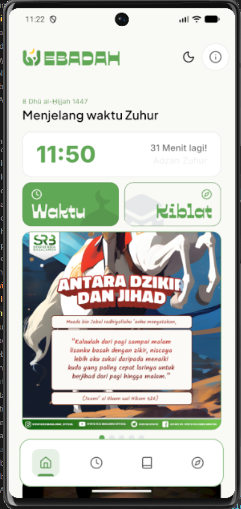
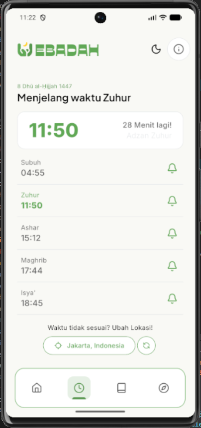
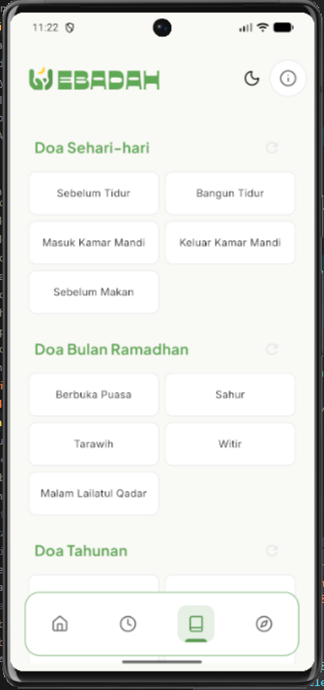
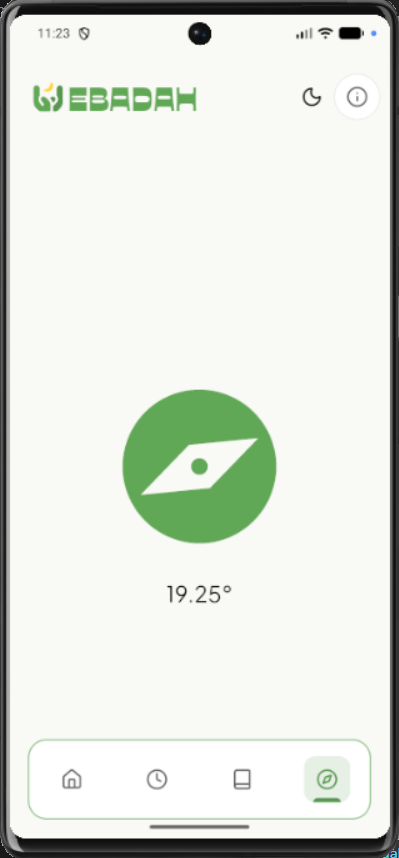

# EBADAH

A modern Islamic worship companion app built with Flutter.  
EBADAH helps users access daily prayers, dzikir, and Islamic content in a clean and organized mobile experience.

---

## 📱 App Preview

<p align="center">
  
  
  
  
</p>

---

## ✨ Features

- 📖 Daily Doa Collection
- 🤲 Dzikir & Prayer Content
- 🗂️ Organized Categories
- 💾 Local Database Storage (SQLite)
- ⚡ Fast Offline Access
- 🎨 Clean Flutter UI
- 🔍 Search & Browse Experience
- 📱 Responsive Mobile Layout

---

## 🛠️ Tech Stack

- Flutter
- Dart
- SQLite
- JSON Local Data
- Material Design

---

## 📂 Project Structure

```bash
lib/
├── models/
│   └── doa_model.dart
├── services/
│   └── doa_service.dart
├── database/
│   └── database_helper.dart
├── screens/
├── widgets/
└── main.dart
```

---

## 🗄️ Database Flow

The application uses:

- `doa_input.json` → dummy/local prayer data
- `database_helper.dart` → SQLite database & table creation
- `doa_service.dart` → insert and fetch data
- `doa_model.dart` → prayer data model

Data from JSON is inserted into the local SQLite database and displayed dynamically inside the app.

---

## 🚀 Getting Started

### 1. Clone Repository

```bash
git clone https://github.com/kramalmr/EBADAH.git
```

### 2. Open Project

```bash
cd EBADAH
```

### 3. Install Dependencies

```bash
flutter pub get
```

### 4. Run Application

```bash
flutter run
```

---

## 📦 Build APK

```bash
flutter build apk
```

Generated APK:

```bash
build/app/outputs/flutter-apk/app-release.apk
```

---

## 🎯 Future Improvements

- 🔔 Prayer Time Notifications
- 🌙 Dark Mode
- ☁️ Cloud Sync
- 📚 More Islamic Content
- 🔊 Audio Prayer Support
- ❤️ Favorite Doa Feature

---

## 👨‍💻 Developer

Made with Flutter by **Muhammad Akram Almair**

---

## 📄 License

This project is for educational (final project of 11th grade) and portfolio purposes.
